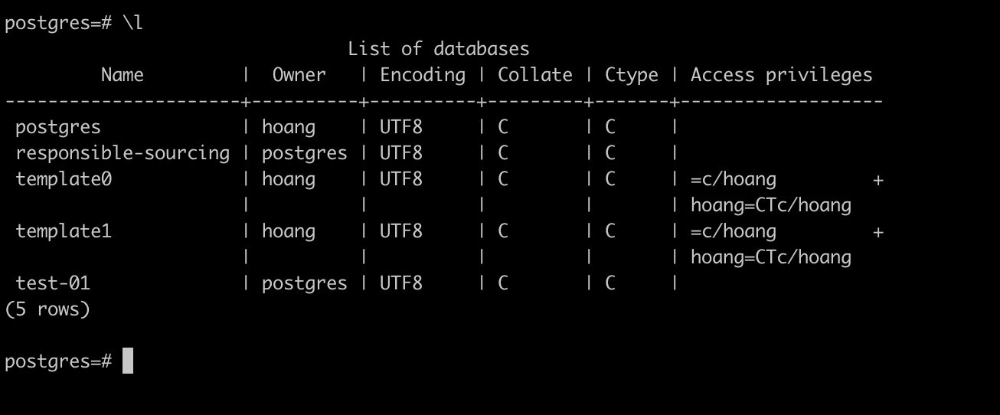
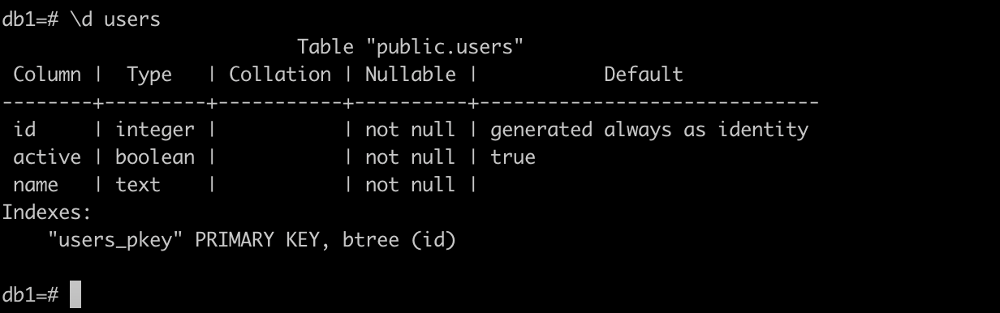

# Basic Architecture and Terminology

## Access Postgres

```bash
psql -U postgres
psql -U postgres -d mydb
psql -U postgres -h localhost
psql -U postgres -p 5432
psql -U postgres -d mydb -h localhost -p 5432
```

## List out database

```bash
\l
```



## Create database

```bash
CREATE DATABASE db1 OWNER postgres;

\c db1
```

output

```
postgres=# CREATE DATABASE db1 OWNER postgres;
CREATE DATABASE
postgres=# \c db1
You are now connected to database "db1" as user "postgres".
db1=#
```


## Create table

```bash
CREATE TABLE users (
    id INT GENERATED ALWAYS AS IDENTITY PRIMARY KEY,
    active BOOLEAN NOT NULL DEFAULT TRUE,
    name TEXT NOT NULL
);
```

Create a table only if it does not already exist

```bash
CREATE TABLE IF NOT EXISTS users (
    id INT GENERATED ALWAYS AS IDENTITY PRIMARY KEY,
    active BOOLEAN NOT NULL DEFAULT TRUE,
    name TEXT NOT NULL
);
```

## Delete Table

```bash
DROP TABLE users;
```

if the table does not exist, no error is raises

```bash
DROP TABLE IF EXISTS users;
```

## Inspect a table

```bash
\d users
```



## List all table

```bash
\dt
```

output

```bash
db1=# \dt
         List of relations
 Schema | Name  | Type  |  Owner
--------+-------+-------+----------
 public | users | table | postgres
(1 row)
```

Searching for table

```bash
\dt us*
```

output

```bash
db1=# \dt us*
         List of relations
 Schema | Name  | Type  |  Owner
--------+-------+-------+----------
 public | users | table | postgres
(1 row)

db1=# \dt foo*
Did not find any relation named "foo*".
db1=#
```
