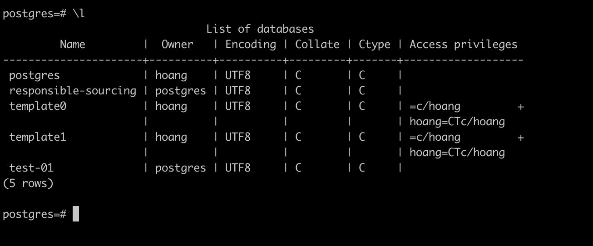

# Postgres Notes

## Access Postgres

```bash
psql -U postgres
psql -U postgres -d mydb
psql -U postgres -h localhost
psql -U postgres -p 5432
psql -U postgres -d mydb -h localhost -p 5432
```

## List out database

```bash
\l
```



## Create database

```bash
CREATE DATABASE db1 OWNER postgres;

\c db1
```

output

```
postgres=# CREATE DATABASE db1 OWNER postgres;
CREATE DATABASE
postgres=# \c db1
You are now connected to database "db1" as user "postgres".
db1=#
```